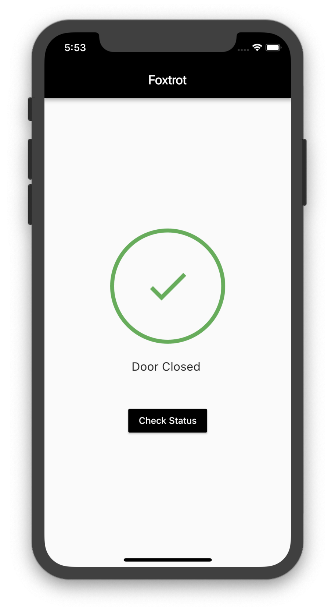
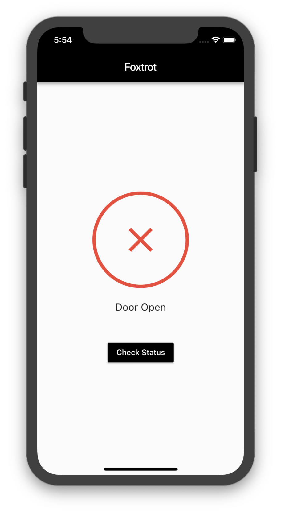

# Foxtrot
##### An IoT device designed to ensure that your front door is closed. (Submitted to [HackberryPi 2019](https://devpost.com/software/big-brother-02vaz8#updates))

### Inspiration
Sometimes I leave my room in a hurry and forget to completely close my door. With many valuables inside, I'd like to know if my door has fully closed when I've left. This is where Foxtrot comes in.

### What it does
Foxtrot is a simple IoT device that determines whether a door is completely closed or not. By using a simple circuit array connected to a door, Foxtrot is able to intelligently relay the status of the door to a mobile application (available on both Android and iOS).

### How I built it
Foxtrot is built using several web and mobile technologies. The system for detecting the open door is a circuit that is completed when the door is closed and open when the door is open (to be implemented). The input for the circuit is read by the Pi, which then processes it and outputs the status using a RESTful Node.js server (the Pi is running NGINX). Then, an Android/iOS mobile application communicates with the server (hosted on the Pi) to determine whether or not the door is open and displays the status on the app accordingly.

### Challenges I ran into
The hard part with this was getting everything to work together. Since, I didn't know Node, NGINX, and creating RESTful APIs prior to completing this project (or anything server related), every step involved included tremendous amounts of research. This was also my first time working with a Raspberry Pi.

### Accomplishments that I'm proud of
- I managed to build a working prototype (excluding the wiring to the door)
- I figured out how to use the Raspberry Pi
- I created a simple server using NGINX and Node.js running on the Pi

### What I learned
- NGINX
- Node
- Designing RESTful APIs
- Raspberry Pi
- Basic Circuitry

### What's next for Foxtrot
- Add a camera unit to detect when someone enters the room
- Detect who enters the room (using facial recognition)
- Logging when the door is opened/closed

### Screenshots

